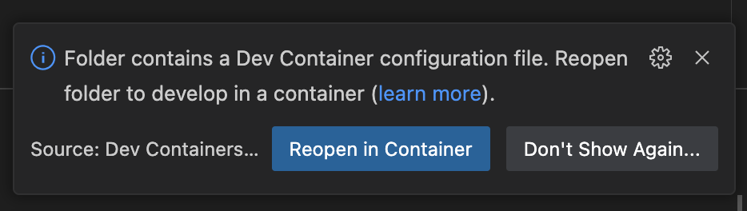
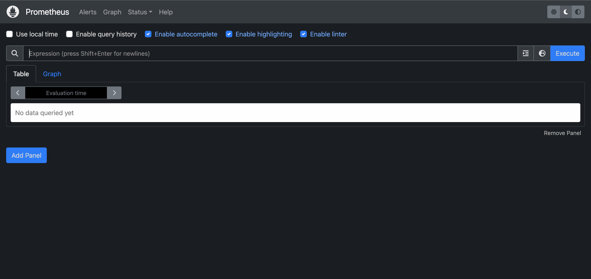
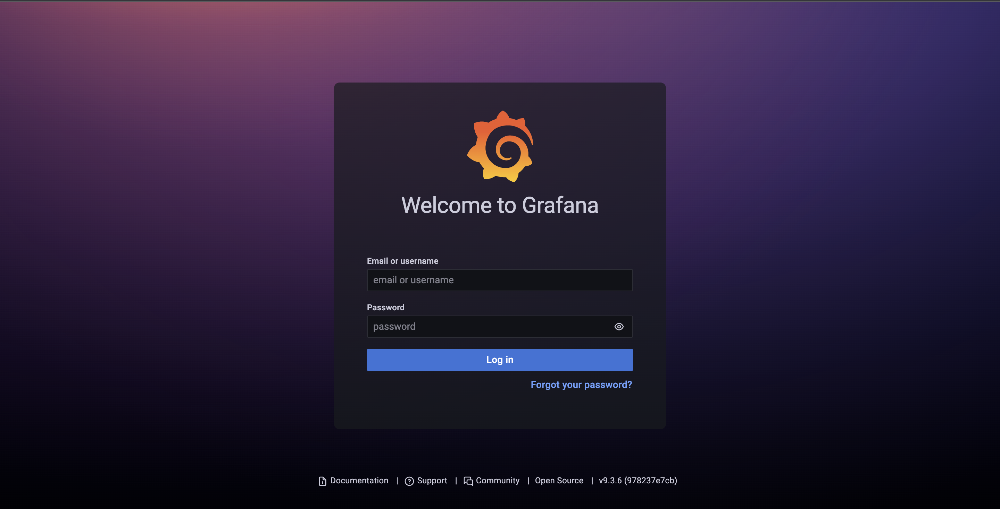

# 4-golden-signals-demo

Окружение для вебинара [Prometheus + Grafana настраиваем 4 golden signals](https://slurm.io/webinars/grafana)

## Requirements

- Visual Studio Code
- Docker + docker-compose

## Структура репозитория

```
├── .devcontainer - описание dev контейнера
├── .vscode - конфигурация Visual Studio Code
├── configs - конфигурация Prometheus
├── demoapp - демо-приложение, отдающее метрики
│   ├── cmd
│   │   ├── app - демо-приложение, отдающее метрики
│   │   └── load - скрипт для генерации нагрузки на демо-приложение
│   └── internal - внутренние библиотеки
│       ├── helpers - вспомогательные методы (e.g. генерация случайных http кодов)
│       ├── metrics - описание метрик
│       └── middleware - middleware для сбора метрик
├── .env - переменные окружения
└── docs - документация
```

## Как работать с репозиторием

1. Клонируем репозиторий и открываем его в Visual Studio Code
2. Visual Studio Code предложит открыть репозиторий внутри docker контейнера, соглашаемся и ждем 
3. После того как открылось новое окно Visual Studio Code, убеждаемся в доступности локального окружения
   1. Убеждаемся что Prometheus доступен по адресу `localhost:9090` 
   2. Убеждаемся что Grafana доступна по адресу `localhost:3000` 
   3. Убеждаемся что в Grafana можно войти с логином и паролем по умолчанию - `admin:admin`
   4. Запускаем демо-приложение, которое должно отдавать метрики - `F5`
   5. Убеждаемся что демо-приложение отдает метрики по адресу `localhost:8080/metrics` 

### Переменные окружения

Значение перменных окружения описаны в файле [.env](./.env). При измений значений в файле нужно перезапускать приложение (не контейнер!)

| Переменная                   | Описание                                                                               | Значение по умолчанию |
| -----------------------------| -------------------------------------------------------------------------------------- | --------------------- |
| HTTP_REQUESTS_INFLIGHT_MAX   | Максимальное количество запросов, которое приложение может обрабатывать "одновременно" | 20 |
| HTTP_REQUESTS_SUCCESSFUL_MAX | Максимальное количество запросов, которое может быть "одновременно" отправлено на эндпойнты, которые возвращают код 2xx | 15 |
| HTTP_REQUESTS_ERROR_MAX      | Максимальное количество запросов, которое может быть "одновременно" отправлено на эндпойнты, которые возвращают код >= 400 | 5 |

## Домашнее задание

1. Изучаем пункты `Структура репозитория` и `Как работать с репозиторием`
2. Форкаем репозиторий к себе
3. По примеру вебинара
   1. Запускаем приложение и скрипт для генерации нрагрузки
   2. Настраиваем в Grafana графики, которые отображают:
      - Latency
      - Traffic
      - Errors
      - Saturation
4. Пробуем различные значения переменных окружения `HTTP_REQUESTS_INFLIGHT_MAX`, `HTTP_REQUESTS_SUCCESSFUL_MAX` и `HTTP_REQUESTS_ERROR_MAX`. Смотрим как меняются графики Traffic, Errors и Saturation
5. Пробуем различные quantile'и (0.5, 0.90, 0.95, 0.99, etc.), смотрим как меняется график Latency